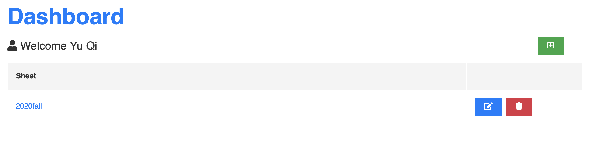
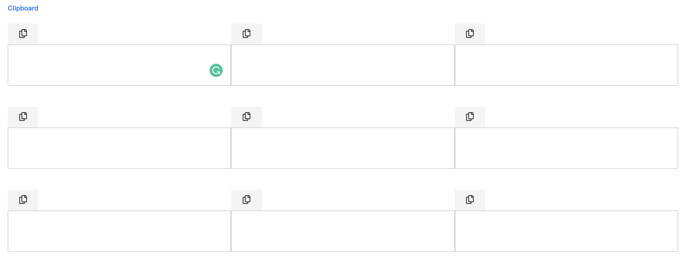

# Welcome to the Job Application Tracker
## [Try iy Now!](https://mighty-lowlands-73122.herokuapp.com)
---
## User Manual

1. Sign up an account and login to the Dashboard, click the green "add" button to create a new sheet

2. Click the sheet name to check all the records
- Active Records: The job applications which you have already submitted, but there is no further feedback.
- Archived Records: You got the result of the job applications.

3. Create an Active Record
- Click the green "add" button.
- The only field you need to focus on is the "Company Name and Position Title". You can type like "apple-software engineer".
- The "Apply Method" is a drop-down menu. You can choose the way of applying for a job.
- The "Submitted Date" will be generated automatically, just leave it blank.
- The "Password" & "Note" are optional.

4. Convenient clipboard under the "Creata a Record"
- The "Creata a Record" interface will keep active when you are submitting a record.
- You can use the clipboard to store information that you want to paste to the job application form in another webpage.
- Please click the "copy" button to copy the text to your computer's clipboard, and the text will be saved automatically.

5. Options for Active Records
- Smiling Face: Got an offer and switch the record to the Archived Records. The "Archived Date" will be generated automatically.
- Crying Face: Opposite to the Smiling Face.

6. Options for Archived Records
- Restore: switch the record to the Active Records

---
If you have any questions, please email qiyunewATgmail.com
